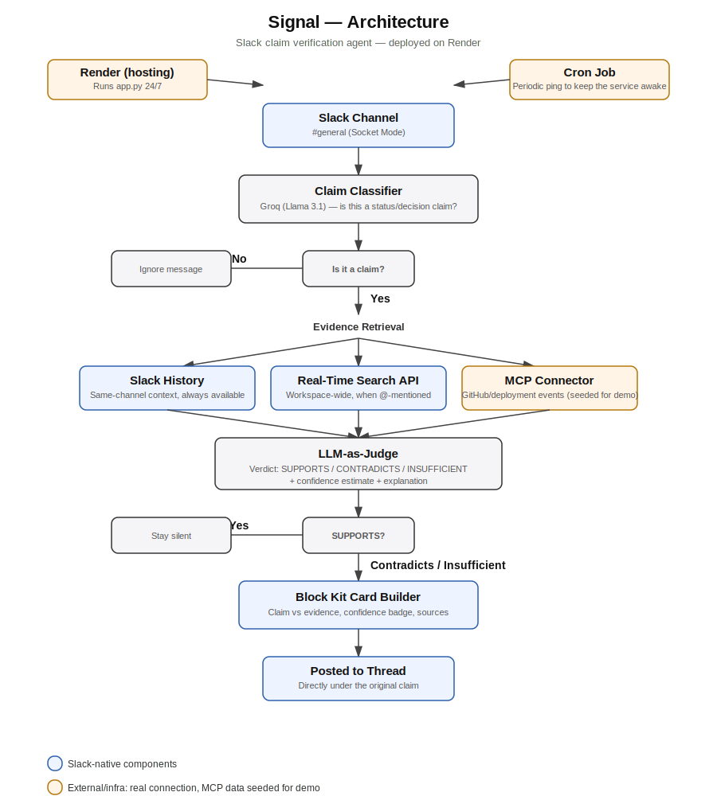

# Elenchus — Slack Claim Verification Agent



Monitors one Slack channel for status/decision claims ("we deployed X",
"we finished Y") and checks them against recent Slack context plus a
GitHub/deployment data source, retrieved over a real MCP (Model Context
Protocol) connection. The underlying repo/deployment data is seeded for
this sandbox demo, but the connection itself is a genuine MCP server and
client talking the actual protocol, not a same-process function call. If
Elenchus finds a contradiction or can't confirm the claim, it posts an
evidence-based intervention card in the thread. If the claim checks out,
it stays silent.

## What's new since the first version

- **Real Slack permalinks in evidence citations** -- evidence now links directly
  to the source message instead of just quoting it, so you don't have to
  remember what to search for later (this was a specifically documented,
  heavily-cited Slack complaint).
- **Cooldown to prevent notification spam** -- Elenchus won't re-flag the same
  topic within 30 minutes, directly addressing notification fatigue, the
  single most-cited Slack complaint by volume.
- **"Verify with Elenchus" manual message shortcut** -- right-click ANY message
  to force a check on demand, including Slack AI/Slackbot output if your
  workspace has it. Slack's own help docs currently tell users to manually
  ask Slackbot again or provide more specific sources when they suspect a
  hallucination -- this shortcut is the automated version of that.

## What's real vs mocked here

- Slack Bolt + Socket Mode: real, connects to your actual sandbox.
- Claim classification + LLM-as-judge: real Groq calls (llama-3.1-8b-instant).
- RTS API: real, via assistant.search.context -- but only activates when
  the bot is @-mentioned (Slack platform constraint, see Optional Setup). 
  Passive monitoring falls back to Slack history.
- MCP connection: real. `mcp_server/server.py` is a genuine MCP server
  (built on the official MCP Python SDK) and `mcp_client.py` connects to
  it as a real MCP client over stdio, using the actual protocol. This was
  tested directly during development, not assumed to work.
- GitHub/deployment data behind that MCP server: mocked, in
  `mcp_server/mock_data.py`, standing in for a live GitHub/deployment
  pipeline connection. 

---

<details>
<summary><h2>🛠️ Click to expand: Step-by-Step Setup & Testing Guide</h2></summary>

Everything below is free. No paid Slack plan, no credit card, no paid API
tier required anywhere in this guide.

### Part 1 — Slack workspace and app

1. **Create a free Slack workspace**: go to slack.com/get-started -> "Create
   a new workspace" -> enter email -> confirm code -> name it anything ->
   skip inviting teammates.
2. **Create a Slack app**: go to api.slack.com/apps -> "Create New App" ->
   "From scratch" -> name it (e.g. "Elenchus") -> pick your new workspace ->
   "Create App".
3. **Enable Socket Mode**: left sidebar -> "Socket Mode" -> toggle on ->
   generate an App-Level Token (name it anything, keep the default
   `connections:write` scope) -> **copy and save this token** (starts with
   `xapp-`). You won't see it again after closing the popup.
4. **Add Bot Token Scopes**: left sidebar -> "OAuth & Permissions" -> scroll
   to "Bot Token Scopes" -> add each of these:
   - `channels:history`
   - `chat:write`
   - `app_mentions:read`
   - `channels:read`
5. **Install the app**: same page, scroll up, click "Install to Workspace"
   -> "Allow" -> **copy and save the Bot User OAuth Token** (starts with
   `xoxb-`) that now appears at the top of the page.
6. **Create a test channel**: in Slack, click "+" next to Channels -> "Create
   a new channel" -> name it `claim-verification` -> public -> Create.
7. **Invite the bot to the channel**: inside the channel, type
   `/invite @Elenchus` (use whatever name you gave the app) and press enter.
   If it doesn't autocomplete, click the channel name -> "Integrations" ->
   "Add apps" -> find your app -> add it.

### Part 2 — Register the manual "Verify with Elenchus" shortcut

1. Go to your app at api.slack.com/apps -> your app -> **Interactivity & Shortcuts**.
2. Toggle **Interactivity** on (Socket Mode means you don't need a Request URL).
3. Scroll to **Shortcuts** -> **Create New Shortcut** -> choose **On messages**.
4. Name it "Verify with Elenchus", set the **Callback ID** to exactly `verify_message`
   (must match what's in app.py), add a short description, save.
5. Reinstall the app to your workspace if prompted (Slack sometimes requires this
   after adding a shortcut).
6. In Slack, hover any message -> click the "More actions" (•••) icon -> you
   should see "Verify with Elenchus" in the list.

### Part 3 — Get a free Groq API key

1. Go to console.groq.com and sign in (Google account works).
2. Left sidebar -> "API Keys" -> "Create API Key".
3. Copy the key (starts with `gsk_`). Groq's free tier requires no credit
   card and has a much higher daily request quota than Gemini's, which
   matters here since the classifier runs on every message.

### Part 4 — Local setup

You need Python 3.10 or newer installed on your machine.

1. Create a virtual environment (recommended):

```bash
python -m venv venv
source venv/bin/activate   # on Windows: venv\Scripts\activate
```

2. Install dependencies:

```bash
pip install -r requirements.txt
```

3. Copy `.env.template` to `.env` and fill in your real tokens:

```bash
cp .env.template .env
```

Then edit `.env` with:
- `SLACK_APP_TOKEN` (starts with `xapp-`, from Socket Mode settings)
- `SLACK_BOT_TOKEN` (starts with `xoxb-`, from OAuth & Permissions)
- `GROQ_API_KEY` (from console.groq.com)
- `TARGET_CHANNEL` (the channel name, no `#`, that you invited the bot to)

---

### Running and Testing it

**Step A: offline test first (recommended, catches most issues fast)**

```bash
python test_offline.py
```

This only needs your `GROQ_API_KEY` to be set. It runs 6 sample messages
through the real classifier, the real MCP server connection, and the real
judge, and tells you if anything disagrees with the expected result. Look
for any line starting with `>>> MISMATCH`. If everything looks clean, move on.

**Step B: connect to live Slack**

```bash
python app.py
```

You should see:

```text
[app] Monitoring channel #claim-verification (C0XXXXXXX)
[app] Elenchus is running. Listening for messages and shortcuts...
```

**Step C: test in Slack**

Post messages in your target channel and watch the terminal output.

**Should trigger a card** (matches the seeded mock evidence served over the real MCP connection in `mcp_server/mock_data.py`):

> "We deployed payments yesterday, all good now."

Expected: agent finds the mocked rollback + failing check + open PR events,
posts a card showing the mismatch with Medium/Low confidence.

**Should stay silent** (small talk, no claim):

> "anyone free for a quick call later?"

**Should stay silent** (claim with no matching/contradicting evidence):

> "We deployed the notifications service, it's live now."

Expected: this matches evt-005 (deployment_success, no incidents) so the
judge should return SUPPORTS and the agent won't post anything.

If claims that should trigger don't, or claims that should stay quiet
fire anyway, check the terminal logs, they print the classification and verdict for every
message so you can see exactly where it went wrong.

---

### Optional: enable the real RTS API (Real-Time Search)

This is optional and separate from everything above -- Elenchus works fully
without it, using Slack conversation history for evidence. RTS adds
richer, workspace-wide search, but ONLY activates when someone @-mentions
the bot directly (e.g. "@Elenchus we deployed payments yesterday") -- Slack
only issues the required token in that specific case, not for passive
channel monitoring. This is a real Slack platform constraint, not a
limitation in this code.

1. In your Slack app settings -> "Features" -> "Agents & AI Assistants" ->
   toggle it on. This auto-adds an `assistant:write` scope.
2. Go to "OAuth & Permissions" -> add the `search:read.public` scope.
3. Go to "Event Subscriptions" -> under "Subscribe to bot events" -> add
   `app_mention` if it isn't already there.
4. Reinstall the app to your workspace (this is required after adding
   scopes) -> if the Bot Token changes, update your `.env`.
5. Test it by @-mentioning the bot with a claim in your channel, e.g.:

   > @Elenchus we deployed payments yesterday, all good now.

   Check the terminal output for the line `action_token present -- using
   real RTS API for workspace-wide context.` If you see that, RTS is
   working. If you don't see it, double check steps 1-3 above.

</details>
